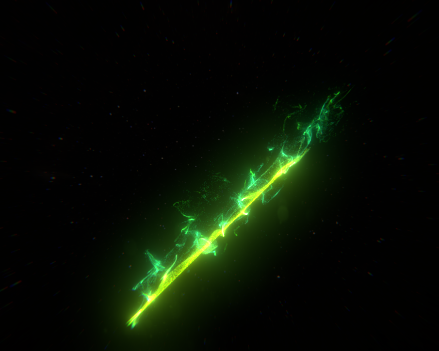
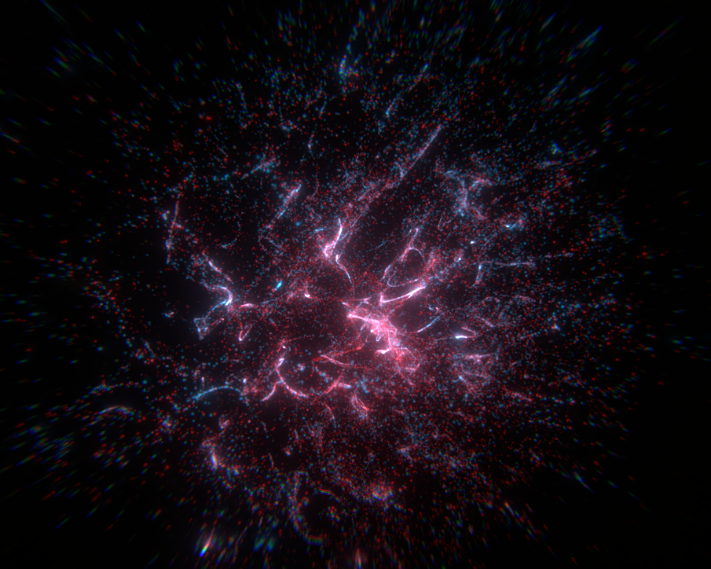
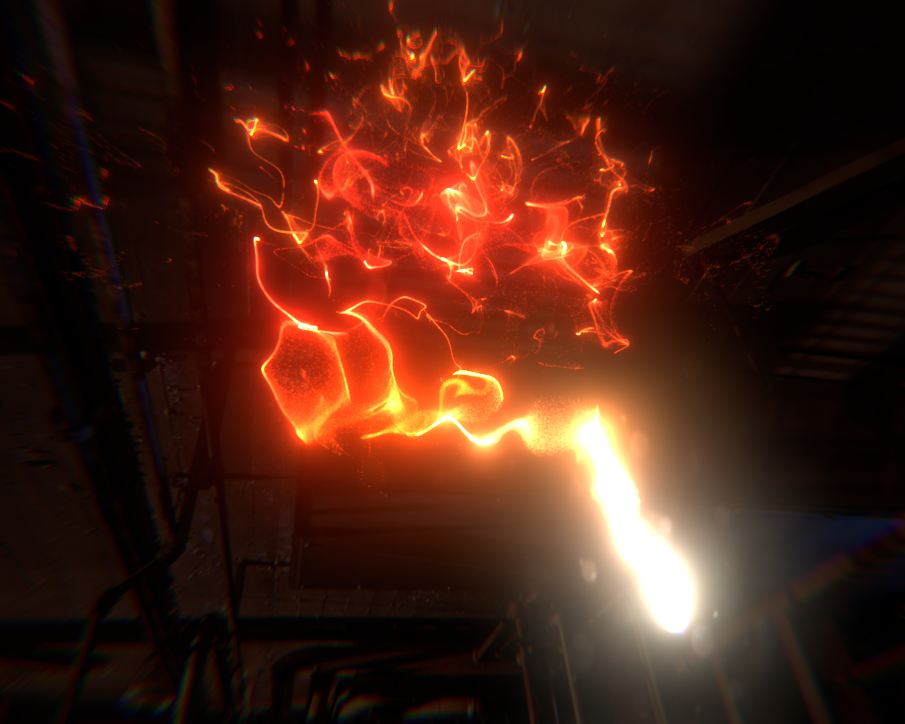
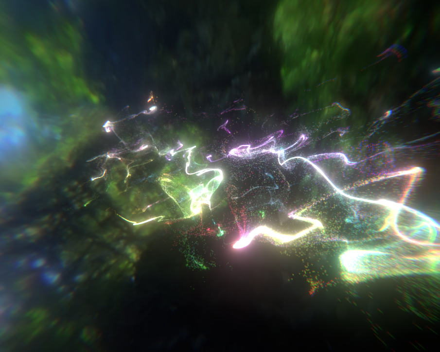

# GPU Particles
A GPU Particle System for [Unity](https://unity3d.com/)

## Screenshots
   

## Features
- GPU-accelerated - Able to handle millions of particles (even without a beast of a PC)
- Lots of customization options
- Fancy Editor:

Note that not all options/features in the inspector have been fully implemented. This version will no longer be updated, as version 2 (V2 branch) is a rewrite from scratch and this project's future (though still WIP).

## System Requirements
Made with Unity 2017.2 & .3. Might work with older versions. Only tested on Desktop with Nvidia GPU. Latest test: 2018.2.0f2; working

## I need your help!
I am currently stuck developing version 2 of the particle system because of some nasty bugs. V2 is rewritten from scratch and will improve on V1's features as well as introduce new ones. It's in this repo's v2 branch. If you are into C# and Compute Shaders and would like V2 to be stable asap, feel free to contribute or [get in touch with me](https://kosro.de/#contact). I'd love to cooperate with you! 

## License
This project is licensed under the MIT License - see the [LICENSE](LICENSE) file for details.

The included sIBL images are from [sIBL Archive](http://www.hdrlabs.com/sibl/archive.html).

  
